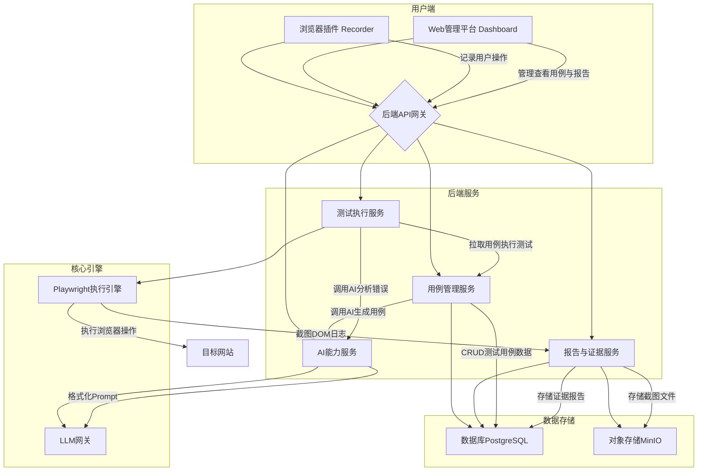

# AI赋能的网页自动化测试工具设计文档

## 1. 项目概述

### 1.1 项目目标

本项目旨在设计并最终实现一个由AI赋能的网页自动化测试工具。该工具将颠覆传统的自动化测试流程，通过引入人工智能技术，实现从测试用例生成、执行、错误分析到报告产出的全流程智能化，从而显著提升测试效率、降低维护成本，并提高软件质量。

核心目标是创建一个不依赖任何特定云厂商原生服务、可本地或服务器部署、支持接入多种大型语言模型（LLM）的开放式测试平台。

### 1.2 核心功能设想

根据初步需求，工具将具备以下核心功能：

- **无代码操作录制**：通过浏览器插件自动记录用户在网页上的操作，生成可执行的原始脚本。
- **AI测试用例生成与优化**：利用LLM将录制的原始操作序列，智能地转化为结构化、可读性强、包含断言的测试用_case_。
- **可视化用例管理**：提供Web界面，方便测试人员审查、修改、组织和管理AI生成的测试用例，并管理测试数据。
- **智能测试执行与调度**：支持按需、定时或批量执行测试用例，并能在本地或远端服务器上运行测试任务。
- **智能错误分析与诊断**：当测试失败时，AI能自动分析失败原因（如元素未找到、断言失败等），并结合截图、DOM变化、控制台日志等信息，提供智能化的错误诊断和修复建议。
- **全方位证据管理**：在测试执行过程中，自动捕获关键节点的网页截图、DOM快照、网络请求等信息作为测试证据，并进行系统化管理。
- **自动化测试报告**：测试运行结束后，自动生成内容详尽、图文并茂的测试报告，直观展示测试结果和覆盖率。
- **开放式LLM接入**：提供灵活的接口，支持接入OpenAI、Ollama等多种模型服务，允许用户根据需求选择最合适的AI能力。

## 2. 系统架构设计

为了实现上述功能并保证系统的灵活性、可扩展性和可维护性，我们设计一个基于微服务思想的模块化架构。系统将由多个独立但协同工作的核心组件构成。

### 2.1 架构图



### 2.2 组件说明

| 组件名称 | 技术选型建议 | 主要职责 |
| :--- | :--- | :--- |
| **浏览器插件 (Recorder)** | Chrome Extension (Manifest V3) | 负责在浏览器中注入脚本，监听并捕获用户的点击、输入等行为，将操作序列发送至后端。 |
| **Web管理平台 (Dashboard)** | React / Vue.js + TailwindCSS | 提供图形化界面，用于管理测试用例、测试套件、测试数据、查看测试报告和测试证据。 |
| **后端API网关** | Node.js (Express / Fastify) | 作为系统的统一入口，负责请求路由、认证、限流等，将前端请求转发到相应的后端服务。 |
| **用例管理服务** | Python (FastAPI) / Go | 负责测试用例、测试数据和测试套件的增删改查，并调用AI服务生成和优化用例。 |
| **测试执行服务** | Node.js | 调度和管理测试任务的执行，与Playwright执行引擎交互，处理测试队列和并发执行。 |
| **Playwright执行引擎** | Playwright Library | 实际的浏览器操作执行者，根据测试用例的步骤驱动浏览器完成自动化操作。 |
| **报告与证据服务** | Python (FastAPI) / Go | 负责在测试执行后，收集所有测试证据（截图、日志等），生成测试报告，并提供查询服务。 |
| **AI能力服务** | Python (FastAPI) | 封装与AI相关的逻辑，包括构建Prompt、调用LLM网关、解析模型返回结果，为其他服务提供AI能力。 |
| **LLM网关** | - | 一个简单的抽象层，统一了对OpenAI、Ollama等不同LLM服务的调用接口，方便切换和扩展。 |
| **数据库** | PostgreSQL | 存储所有结构化数据，如测试用例、测试结果、用户信息、报告元数据等。 |
| **对象存储** | MinIO (S3兼容) | 存储非结构化数据，主要是测试证据，如截图、录屏、DOM快照文件等。 |

## 3. 核心功能模块设计

接下来，我们将对每个核心功能的实现思路进行详细设计。

### 3.1 无代码操作录制 (Browser Recorder)

操作录制是整个自动化流程的起点，其核心是精确、无遗漏地捕获用户与网页的交互行为。

**实现流程:**
1.  **启动录制**: 用户在浏览器插件中点击“开始录制”按钮。
2.  **事件监听**: 插件向当前页面注入一个Content Script。该脚本使用`addEventListenner`监听DOM事件，如`click`, `input`, `change`, `keydown`等。
3.  **操作捕获与筛选**: 每当监听到有效交互事件（如点击一个按钮、在输入框中输入文本），脚本会捕获该事件的详细信息。为了减少噪音，需要忽略纯粹的鼠标移动（`mousemove`）等非关键事件。
4.  **元素定位器生成**: 对于每个交互，必须生成一个稳定、唯一的选择器（Selector）来定位目标DOM元素。为提高鲁棒性，应生成多种选择器，并按优先级排序：
    -   **高优先级**: `[data-testid]`, `[data-cy]`等专门用于测试的属性。
    -   **中优先级**: 唯一的ID (`#element-id`)、`name`属性。
    -   **低优先级**: 组合的CSS类名、XPath。
    -   **备选方案**: 文本内容、元素在DOM树中的相对位置。
5.  **操作序列化**: 将捕获到的操作（如`click`, `type`）连同其目标元素的选择器、输入值等信息，序列化为一个JSON对象数组。例如：
    ```json
    [
      {
        "action": "type",
        "selector": "#username",
        "value": "testuser"
      },
      {
        "action": "click",
        "selector": "button[type=submit]"
      }
    ]
    ```
6.  **发送后端**: 插件将这个JSON数组实时或在录制结束后一次性发送到后端的API网关，最终由“用例管理服务”接收并暂存。

### 3.2 AI测试用例生成与优化

此模块是工具“智能”化的核心体现，它将机器记录的原始操作，转化为人类可理解、可维护的测试用例。

**实现流程:**
1.  **接收原始操作**: “用例管理服务”接收到来自浏览器插件的原始操作JSON序列。
2.  **构建Prompt**: 服务将该JSON序列、目标页面的URL以及预设的指令模板，组合成一个发送给LLM的Prompt。Prompt的设计至关重要，需要引导LLM完成以下任务：
    -   **理解操作意图**: 分析操作序列的整体目标（如“登录”、“搜索商品”）。
    -   **分组与命名**: 将连续的操作组合成有意义的步骤，并为每一步生成人类可读的名称。
    -   **添加断言**: 在关键步骤后，智能地插入断言（Assertions）。例如，点击登录按钮后，应断言页面跳转到了dashboard，或者出现了“欢迎您”的字样。LLM可以根据操作上下文推荐合适的断言。
    -   **参数化**: 识别操作中的硬编码值（如用户名、搜索关键词），并将其转化为变量，方便后续进行数据驱动测试。
3.  **调用LLM网关**: “AI能力服务”将构建好的Prompt通过“LLM网关”发送给用户配置的模型（OpenAI或Ollama）。
4.  **解析与存储**: 服务接收LLM返回的结构化测试用例（例如，也是一个JSON格式，但带有步骤描述、断言等信息），解析后存入数据库。

**示例：**

*   **输入 (原始操作)**: `[{action: 'type', ...}, {action: 'click', ...}]`
*   **输出 (AI生成的测试用例)**:
    ```json
    {
      "name": "用户成功登录测试",
      "steps": [
        {
          "name": "输入用户名",
          "action": "type",
          "selector": "#username",
          "value": "${username}" // 参数化
        },
        {
          "name": "点击登录按钮",
          "action": "click",
          "selector": "button[type=submit]"
        }
      ],
      "assertions": [
        {
          "type": "urlContains",
          "value": "/dashboard",
          "description": "页面应跳转到仪表盘"
        }
      ]
    }
    ```

### 3.3 智能测试执行与错误分析

该模块负责实际运行测试并对结果进行智能分析。

**测试执行流程:**
1.  **触发执行**: 用户在Web管理平台点击“执行”按钮，或通过CI/CD流水线触发API。
2.  **任务下发**: “测试执行服务”从数据库中拉取指定的测试用例和测试数据。
3.  **动态代码生成**: 服务将测试用例的JSON描述动态地翻译成Playwright可以执行的脚本代码（JavaScript或Python）。
4.  **执行与证据收集**: “Playwright执行引擎”运行生成的脚本。在每个操作步骤执行前后，引擎都会自动执行以下操作：
    -   **截图**: 对整个页面进行截图。
    -   **DOM快照**: 保存当前页面的完整DOM结构为HTML文件。
    -   **信息留存**: 记录浏览器控制台日志、网络请求等信息。
    -   所有这些证据都会被赋予唯一ID，并与当前测试步骤关联，然后发送到“报告与证据服务”。
5.  **结果上报**: 执行引擎将每一步的执行结果（成功/失败）上报给“测试执行服务”。

**智能错误分析流程:**
1.  **捕获失败**: 当Playwright执行某个操作（如`page.click()`)失败并抛出异常时，执行引擎捕获该异常。
2.  **收集上下文**: 引擎立刻收集失败瞬间的详细上下文信息，包括：
    -   失败前的截图和失败后的截图（如果可能）。
    -   失败时的DOM快照。
    -   Playwright抛出的原始错误信息。
    -   相关的控制台日志和网络请求记录。
3.  **调用AI分析**: “测试执行服务”将这些上下文信息打包，通过“AI能力服务”发送给LLM进行分析。Prompt会要求LLM扮演一个资深测试专家的角色，分析失败的根本原因。
4.  **生成诊断报告**: LLM可能会返回类似以下的分析结果：
    -   **根本原因**: “目标元素`.button-submit`未在页面上找到。”
    -   **可能解释**: “1. 元素的选择器已过时，前端代码可能已更新。2. 元素是动态加载的，测试脚本没有等待它出现。3. 上一步操作失败，导致页面未正常跳转。”
    -   **修复建议**: “1. 尝试使用更稳定的选择器，如`[data-testid='login-button']`。2. 在点击操作前增加一个等待元素可见的步骤 `waitForSelector`。”
5.  **结果入库**: 这些由AI生成的诊断信息将作为测试结果的一部分，存入数据库，并在最终的测试报告中展示。

### 3.4 管理功能设计

一个强大的管理后台是保证工具可用性的关键。

-   **测试用例管理**: 提供一个类似IDE的界面，允许用户以树状结构组织测试用例和测试套件。用户可以拖拽、编辑、复制和删除用例。用例编辑器应提供语法高亮和自动补全功能，即使是对JSON格式的编辑。
-   **测试数据管理**: 允许用户上传和管理测试数据（如CSV文件），并在执行测试时将数据动态绑定到测试用例的参数化变量上。
-   **测试证据管理**: 提供一个“证据浏览器”，用户可以根据测试运行ID、用例ID或时间范围，轻松查看和比较任意两次测试运行的截图、DOM快照。前后比较功能可以通过像素级对比（Pixel-diff）或DOM结构对比（DOM-diff）来实现。
-   **测试报告管理**: 集中展示所有测试运行的历史记录和报告。提供筛选、排序和搜索功能。报告应是可分享的，生成一个唯一的URL供团队成员查看。

### 3.5 开放式LLM接入

为了支持不同的AI模型，AI能力服务内部需要一个LLM网关。

-   **统一接口**: 网关定义一个统一的`generate`函数，接收标准化的输入（如`model`, `prompt`, `temperature`等）。
-   **适配器模式**: 为每一种LLM服务（如OpenAI API, Ollama API）实现一个适配器（Adapter）。每个适配器负责将统一的输入格式转换为特定API所需的请求格式，并处理其认证（如API Key）。
-   **配置驱动**: 系统管理员可以在配置文件或Web界面的设置页面中，添加和配置不同的LLM端点（Endpoint）和凭证。用户在生成用例或分析错误时，可以选择使用哪个已配置的LLM。

## 4. 部署与技术栈总结

### 4.1 部署方案

整个系统将被容器化（Docker），并通过`docker-compose`进行编排，以实现一键本地部署。对于服务器部署，可以提供Kubernetes的部署清单（Helm Chart）。这种方式确保了环境的一致性，并满足了“可在本机或服务器跑”的要求。

### 4.2 技术栈概览

| 领域 | 技术/工具 |
| :--- | :--- |
| **前端** | React, TypeScript, TailwindCSS, Chrome Extension APIs |
| **后端** | Node.js (Fastify), Python (FastAPI), Go (可选) |
| **浏览器自动化** | Playwright |
| **数据库** | PostgreSQL |
| **对象存储** | MinIO |
| **AI模型接口** | OpenAI API, Ollama |
| **容器化** | Docker, Docker Compose |

---

**文档结束**
